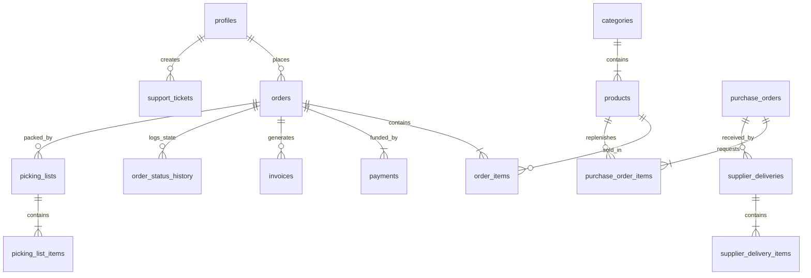
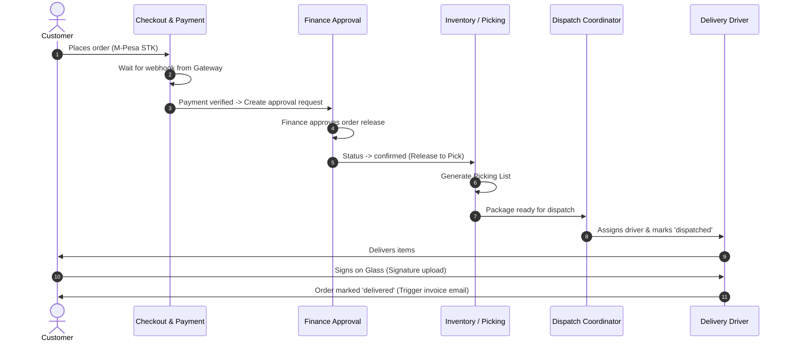

# NexusTech Hub — Project Documentation

NexusTech Hub is a premium, modern, high-performance, multi-tenant/multi-portal enterprise e-commerce and ERP platform tailored for the Kenyan electronics market. Built using a serverless "Thin Client" architecture, the application integrates public e-commerce with backend ERP capabilities (Finance, Inventory, Dispatch, Driver, and Supplier Portals).

---

## 🗺️ System Architecture

```mermaid
graph TD
    %% Client Layer
    subgraph Client Layer (React 19 / Capacitor)
        Storefront["🛒 Public Storefront (Web)"]
        MobileApp["📱 Android App (Capacitor)"]
        Portals["🖥️ Multi-Portal Dashboards (Admin, Finance, Inventory, Dispatch, Driver, Supplier)"]
    end

    %% Routing / Auth
    Router["react-router-dom Router"]
    AuthContext["AuthContext (JWT & Custom Roles)"]
    
    %% API / Gateway
    subgraph Supabase Backend (Serverless)
        AuthService["Supabase Auth"]
        Database[("PostgreSQL Database + RLS")]
        EdgeFunctions["Edge Functions (Deno)"]
    end

    %% External Systems
    subgraph Third-Party Services
        MPesa["Safaricom M-Pesa API"]
        Flutterwave["Flutterwave Payment Gateway"]
        PayPal["PayPal SDK"]
        Resend["Resend Email API"]
        Sentry["Sentry Error Tracking"]
    end

    Storefront --> Router
    MobileApp --> Router
    Portals --> Router
    
    Router --> AuthContext
    AuthContext --> AuthService
    Router --> Database
    Router --> EdgeFunctions
    
    EdgeFunctions --> MPesa
    EdgeFunctions --> Flutterwave
    EdgeFunctions --> PayPal
    EdgeFunctions --> Resend
    
    ClientLayer -.-> Sentry
```

### Technology Stack
- **Frontend Framework**: [React 19](https://react.dev) + [Vite](https://vite.dev)
- **Styling**: [Tailwind CSS](https://tailwindcss.com) + [Lucide Icons](https://lucide.dev)
- **State Management & Routing**: Context API, React Router v6
- **Database Backend**: [Supabase](https://supabase.com) (PostgreSQL, Realtime, Storage)
- **Edge Logic**: Supabase Edge Functions (TypeScript, Deno)
- **Mobile Container**: [Capacitor](https://capacitorjs.com) (Targeting native Android integration)
- **Error Reporting**: [Sentry](https://sentry.io) React & Capacitor SDKs

---

## 🚪 Application Portals (Role-Based Access)

The platform is structured into distinct, security-hardened portals driven by database roles in the `profiles` table:

| Portal | Intended Role | Key Features |
| :--- | :--- | :--- |
| **Public Storefront & Cart** | `anonymous` / `customer` | Product catalogs, search, wishlist, responsive shopping cart, checkout, payment processing page. |
| **Customer Dashboard** | `customer` | Profile & account settings, order history tracking, support tickets chat, corporate business profile. |
| **Admin Dashboard** | `admin` / `manager` | CRM, global inventory manager, system diagnostics logs, analytics dashboard (Recharts), refunds processor. |
| **Finance Portal** | `finance` | Transaction ledger, budget/expense approval, invoice generation, expense categories, financial analytics. |
| **Inventory Portal** | `inventory` | Purchase orders, Goods Received Notes (GRN), damaged stock tracker, bin/warehouse locations, stock transfer logging. |
| **Supplier Portal** | `supplier` | Supplier product list management, processing purchase orders, restock status. |
| **Dispatch Portal** | `dispatch` | Fleet route planning, dispatch handoff status, driver assignment roster. |
| **Driver Portal** | `driver` | Delivery lists, map-pin navigation, digital signature capture, delivery status transitions (`assigned` ➡️ `in_transit` ➡️ `delivered`). |

---

## 🗄️ Database & Schema Design

All tables reside in the `public` schema of Supabase. Access is governed via Row Level Security (RLS) policies.



### Core Schema Modules

1. **E-commerce & Customers**:
   - `profiles`: Extends Supabase auth to include names, phones, roles (`customer`, `admin`, `finance`, `inventory`, `driver`, `dispatch`, `supplier`), and addresses.
   - `products` & `categories`: Product details, SKU, stock count, low-stock threshold, price, images.
   - `orders` & `order_items`: Order amount, shipping address, status (`pending`, `confirmed`, `picking`, `dispatched`, `delivered`, `cancelled`).
   - `wishlist` & `cart_items`: Client state synchronization.

2. **Payments & Invoicing**:
   - `payments` & `payment_logs`: Tracking IDs for transaction gateways (M-Pesa `CheckoutRequestID`, Flutterwave ID, PayPal Order ID) and statuses (`pending`, `completed`, `failed`).
   - `invoices`: Holds metadata of generated PDF receipts, trigger timestamp, and dispatch flag.

3. **Logistics & Warehousing**:
   - `picking_lists` & `picking_list_items`: Internal instructions showing warehouse bins where stock is located.
   - `inventory_approvals`: Multi-step verification workflow for structural inventory shifts (adjustments, write-offs).
   - `inventory_logs`: Tracks all stock additions, sales, transfers, and corrections.

4. **Procurement**:
   - `purchase_orders` & `purchase_order_items`: Requisitions sent to suppliers for replenishment.
   - `supplier_deliveries` & `supplier_delivery_items`: Tracks deliveries from suppliers (linking to Goods Received Notes).

5. **Fleet & Deliveries**:
   - `delivery_proofs`: Stores digital signatures or photos representing delivered items.
   - `delivery_events`: Tracks locations and time-stamped status changes.

6. **System Resilience**:
   - `failure_logs`: Logs payment or integration failures for automated healing.
   - `retry_queue`: Job queue for retrying transient third-party API issues.

---

## 🔄 Critical Workflows

### 1. Order-to-Delivery Pipeline



### 2. Supplier Replenishment Loop
1. **Low Stock Detection**: Trigger checks if `products.stock_count` < `products.low_stock_threshold`.
2. **Purchase Order Generation**: Drafted in the Inventory portal and dispatched to the Supplier portal.
3. **Supplier Fulfillment**: Supplier acknowledges order and changes state to `shipped`.
4. **Goods Received**: Inventory staff processes the shipment using a Goods Received Note (GRN). This automatically updates `products.stock_count` and updates the purchase order to `completed`.

---

## 🛠️ Local Development & Setup

### Environment Variables (`.env`)
Make sure to copy or create `.env` in the root workspace folder:

```env
VITE_SUPABASE_URL="https://your-project.supabase.co"
VITE_SUPABASE_ANON_KEY="eyJhbGciOi..."
VITE_SENTRY_DSN="https://..."
```

### Key CLI Commands

- **Run Dev Server**:
  ```bash
  npm run dev
  ```
- **Build Web Bundle**:
  ```bash
  npm run build
  ```
- **Sync Mobile Android Shell**:
  ```bash
  npx cap sync android
  ```
- **Open Project in Android Studio**:
  ```bash
  npx cap open android
  ```
- **Deploy Supabase Edge Functions**:
  ```bash
  npx supabase functions deploy <function-name> --project-ref <ref>
  ```

---

## 🔒 Security & Row Level Security (RLS)

NexusTech Hub enforces database isolation at the SQL level. RLS policies verify user authentication states via standard JWT parameters (`auth.uid()`) and validate access permissions via custom claims or lookup checks:

- **Customers** can read and modify only their own profile details, carts, wishlists, and orders.
- **Inventory Staff** are granted access to products, picking lists, stock entries, and supplier deliverables.
- **Finance Staff** have write privileges on ledger records, invoices, and expense approvals.
- **Drivers** have read privileges on the deliveries assigned to their user ID, with restricted write access to update status and upload delivery signatures.

---

## 💡 Troubleshooting & Diagnostics

- **Build Version Mismatch**: In case of deployment issues on Vercel related to Sentry, check that both `@sentry/react` and `@sentry/capacitor` share the identical version number in [package.json](file:///e:/NexusTech-Hub--main/package.json).
- **Auto-Healing Inventory**: A cron script checks for mismatched stock tables and reconciles logs automatically in the background. Check logs in `public.failure_logs`.
